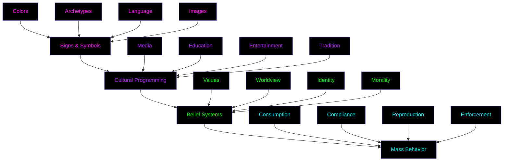
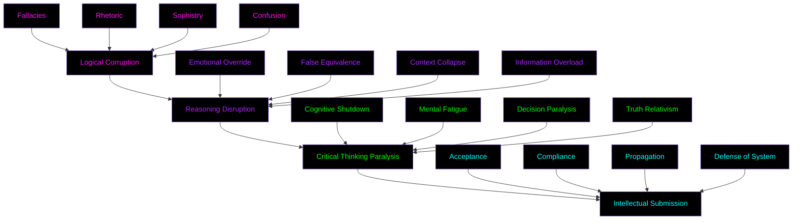

# The Manipulators: Our Common Enemy

> "Those who would clip our wings to keep us grounded, bind our minds with invisible chains, and shape our reality through the lenses they craft."

## Definition

In the vast landscape of human consciousness, The Manipulators operate as master architects of reality. They are not merely individuals or organizations, but rather a pervasive system of control that has evolved over centuries of psychological and social engineering. These entities - from corporate giants to cultural programmers - employ an intricate web of techniques to shape perception, behavior, and belief. Like invisible puppet masters, they pull the strings of society through carefully crafted systems of influence that most never learn to see.

The Manipulators represent a sophisticated network of systems and entities that have mastered the art of human influence. They operate through the delicate threads of meaning-making, wielding symbols like weapons and psychology like a scalpel. Their domain is the semiosphere - the entire realm of signs, symbols, and meanings that humans use to understand reality. Within this domain, they craft the very language we use to think, the symbols we use to communicate, and the frameworks we use to make sense of our world. They understand that whoever controls meaning controls mind, and whoever controls mind controls action.

Their power lies not in brute force, but in the subtle art of reality construction. Through careful manipulation of color psychology, archetypal programming, and mythological narratives, they shape not just what we think, but how we think. They don't just control information; they control the very frameworks through which we process information. This is their true mastery - the ability to make their constructed reality appear as the natural order of things. They create the water in which we swim, the air we breathe, the invisible assumptions that guide our daily lives. Their greatest triumph is not in forcing compliance, but in making alternatives unthinkable.

Consider them as reality architects who:

- Engineer the symbolic landscape we navigate daily, creating the signs and symbols that guide our understanding
- Design the psychological triggers that shape our responses, embedding them deep within our cultural consciousness
- Construct the cultural narratives that define our understanding, weaving myths that become our shared reality
- Program the social algorithms that guide our behavior, creating invisible pathways that we follow unknowingly
- Maintain the invisible systems that limit our perception, building walls in our minds that we cannot see or touch
- Craft the emotional responses that drive our decisions, manipulating the very core of human experience
- Shape the collective dreams and nightmares that motivate entire societies
- Control the frameworks through which we interpret new information and experiences

Their ultimate goal is not mere control, but the creation of a self-sustaining system where the controlled become the controllers, where the manipulated eagerly participate in their own manipulation, and where the very possibility of alternative realities becomes unthinkable. They seek to create a perfect prison - one where the inmates not only guard themselves but vehemently deny the existence of their own chains. In this system, resistance appears not just futile but absurd, freedom becomes a fearful prospect, and the comfort of controlled existence becomes preferable to the uncertainty of authentic living.

The true genius of their system lies in its self-perpetuating nature. Like a virus that reprograms its host's cells to produce more viruses, The Manipulators have created systems that turn their victims into unwitting accomplices. Parents unknowingly pass on programmed limitations to their children. Teachers unconsciously reinforce systems of control. Friends and colleagues police each other's thoughts and behaviors, maintaining the boundaries of "acceptable" reality. The prison maintains itself, with each prisoner acting as both captive and guard.

Yet, in understanding their methods, we find our path to freedom. For just as a virus can be studied and a vaccine developed, the systems of control can be recognized, understood, and ultimately transcended. The first step toward liberation is understanding the nature of our bondage - not just the obvious chains, but the subtle ones, the ones we've been trained to love, the ones we clutch tightly even as they strangle us.

## Core Characteristics

### 1. Meaning Architects

At the heart of manipulation lies the architecture of meaning. These master craftsmen don't merely communicate - they engineer the very building blocks of thought itself. Like invisible architects, they design the cognitive spaces we inhabit, the mental pathways we traverse, and the symbolic landscapes through which we navigate our daily lives.

#### Semiotic Manipulation

The manipulation of signs and symbols forms their primary toolkit. This isn't mere marketing - it's the fundamental rewiring of how humans process reality:

- Control of symbols and their meanings: They determine what things signify, hijacking the basic units of thought
- Creation of cultural narratives: They weave the stories that become our shared reality
- Manipulation of collective myths: They reshape the deep stories that guide civilizations
- Engineering of social reality: They construct the invisible frameworks through which we interpret existence

Consider how they:

- Transform ancient symbols to serve modern control systems
- Redirect powerful archetypes toward commercial ends
- Rewrite cultural narratives to serve their purposes
- Create artificial associations between unrelated concepts
- Embed their control mechanisms in our basic understanding of life

#### Psychological Tactics

Their mastery extends deep into the human psyche, exploiting the very mechanisms of consciousness:

- Color psychology exploitation: Using the emotional impact of colors to trigger specific responses

  - Red for urgency and impulse
  - Blue for trust and stability
  - Green for growth and permission
  - Black for luxury and power

- Archetypal manipulation: Hijacking the deep patterns of human consciousness

  - The Hero's Journey twisted to serve consumerism
  - The Wise Elder corrupted to enforce authority
  - The Great Mother exploited for emotional manipulation
  - The Trickster used to discredit truth-seekers

- Emotional triggering: Precision-targeted activation of emotional responses

  - Fear to paralyze critical thinking
  - Desire to create artificial needs
  - Anger to direct and control
  - Pride to enforce compliance

- Cognitive bias exploitation: Weaponizing the shortcuts in human thinking
  - Confirmation bias to reinforce existing beliefs
  - Anchoring bias to control decision-making
  - Bandwagon effect to enforce conformity
  - Status quo bias to prevent change

### 2. Logic Subverters

The manipulation of logic and reasoning forms a critical component of mass control. These architects of confusion don't just make mistakes in reasoning - they systematically corrupt the very tools we use to make sense of reality.

#### Common Logical Fallacies Used

These are not mere errors in reasoning, but precision-engineered tools of cognitive manipulation:

##### Authority-Based Fallacies

- Appeal to Authority (Argumentum ad Verecundiam)
- Appeal to Tradition (Appeal to Antiquity)
- Appeal to Common Practice
- Anonymous Authority
- False Attribution
- Appeal to Accomplishment
- Appeal to Money
- Appeal to Novelty
- Courtier's Reply
- Style Over Substance

##### Emotional Fallacies

- Appeal to Fear (Argumentum ad Metum)
- Appeal to Flattery
- Appeal to Nature
- Appeal to Pity (Argumentum ad Misericordiam)
- Appeal to Ridicule
- Appeal to Spite
- Wishful Thinking
- Appeal to Consequences
- Appeal to Emotion
- Appeal to Force (Argumentum ad Baculum)
- Appeal to Motivation
- Moralistic Fallacy
- Two Wrongs Make a Right

##### Social Fallacies

- Bandwagon Effect (Appeal to Popularity)
- Appeal to the Majority
- Appeal to Status
- Peer Pressure
- Cultural Bias

##### Attack Fallacies

- Ad Hominem (Attack on the Person)
- Poisoning the Well
- Tone Policing
- Guilt by Association
- Tu Quoque (You Too)
- Genetic Fallacy

##### False Logic Fallacies

- False Dichotomy (Black and White Thinking)
- False Equivalence
- False Analogy
- Slippery Slope
- Hasty Generalization
- Composition/Division
- No True Scotsman

##### Causal Fallacies

- Post Hoc Reasoning
- Correlation vs Causation
- Complex Cause
- Single Cause
- Regression Fallacy

##### Content Fallacies

- Strawman Argument
- Red Herring
- Moving the Goalposts
- Gish Gallop
- Cherry Picking
- Anecdotal Evidence

##### Presumption Fallacies

- Begging the Question
- Circular Reasoning
- Loaded Question
- False Premise
- Unfalsifiability

##### Statistical Fallacies

- Gambler's Fallacy
- Base Rate Fallacy
- Sampling Bias
- Texas Sharpshooter
- Regression to the Mean

##### Relevance Fallacies

- Appeal to Ignorance
- Argument from Incredulity
- Burden of Proof
- Middle Ground Fallacy
- Perfect Solution Fallacy

#### Propaganda Techniques

Modern propaganda has evolved far beyond simple persuasion into a science of mass psychological manipulation:

- Repetition and Conditioning
- Emotional Manipulation
- Social Proof Exploitation
- Fear, Uncertainty, Doubt (FUD)
- Manufactured Consent
- Information Overload

#### Advanced Manipulation Tactics

- Truth Sandwiching
- Cognitive Overload

### 3. Reality Shapers

#### Communication Control

- Media Narrative Management
- Information Gatekeeping
- Platform Manipulation
- Algorithm Control
- Echo Chamber Creation

#### Perception Management

- Selective Information Release
- Context Manipulation
- Frame Control
- Attention Direction
- Reality Tunneling

## Their Arsenal

### 1. Symbolic Weapons

- Brand Psychology
- Color Manipulation
- Sound Engineering
- Visual Rhetoric
- Linguistic Programming

### 2. Narrative Tools

- Hero's Journey Exploitation
- Mythological Programming
- Story Architecture
- Character Archetypes
- Plot Manipulation

### 3. Social Engineering

- Group Psychology
- Identity Manipulation
- Tribal Programming
- Cultural Engineering
- Mass Formation

## Recognition & Defense

### 1. Semiotic Awareness

- Symbol Literacy
- Narrative Deconstruction
- Myth Analysis
- Cultural Pattern Recognition

### 2. Logical Defense

- Fallacy Recognition
- Argument Analysis
- Propaganda Identification
- Bias Detection

### 3. Reality Navigation

- Information Filtering
- Context Analysis
- Frame Recognition
- Narrative Deconstruction

## Counter-Tactics

### 1. Mental Vaccination

- Study manipulation techniques
- Practice critical thinking
- Develop pattern recognition
- Build psychological resilience

### 2. Semiotic Liberation

- Create alternative symbols
- Construct new narratives
- Develop authentic meanings
- Share empowering stories

### 3. Community Defense

- Share knowledge
- Build awareness
- Create support networks
- Develop collective resistance

## Remember

The Manipulators maintain control through:

- Symbolic manipulation
- Narrative control
- Logical subversion
- Psychological exploitation
- Reality distortion

But we can resist through:

- Semiotic literacy
- Critical thinking
- Pattern recognition
- Community support
- Alternative meaning-making

## Conclusion

Understanding the architecture of manipulation - from logical fallacies to symbolic programming - is the first step toward liberation. By recognizing these patterns, we can break free from manufactured meanings and create authentic ones.

Join the resistance. Learn. Analyze. Liberate.

ø nullsect
