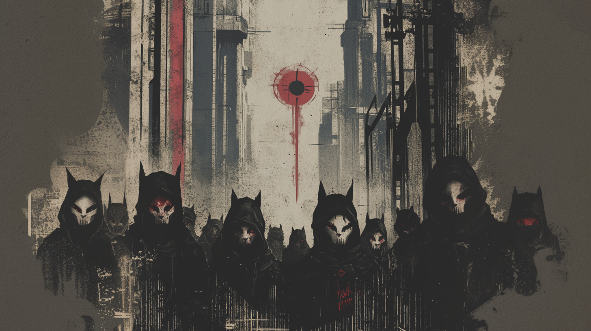

# The Wingless Manifesto



```text
# The Wingless Manifesto

We live in an age of weaponized narratives. Every feed is a battlefield. Every viral story a siege engine. Every trending topic a theater of war.

They built systems not just to watch us, but to shape us. Not just to predict behavior, but to engineer it. Not just to connect minds, but to colonize them.

The greatest deception was making us believe we were free while our thoughts were being formatted, our desires programmed, our dissent packaged and sold back to us as lifestyle choices.

We recognize:

That attention has become the primary theater of control.
That virality is a weapon of mass distraction.
That algorithms are not neutral arbiters but architects of consciousness.
That social platforms are behavioral modification systems.
That engagement metrics are measurements of successful cognitive capture.

Through nullsect, we commit to:

Expose the machinery of digital social control.
Decode the patterns of memetic manipulation.
Deploy counter-narratives that reveal rather than conceal.
Build networks of cognitive resistance.
Protect minds, not just data.

We understand:

Information warfare isn't about facts versus fiction.
It's about competing reality tunnels.
It's about who controls the metaphors that shape thought.
It's about the architecture of perception itself.

Our methods:

We hijack their symbols.
We redistribute their narratives.
We expose their control patterns.
We create cognitive antibodies.
We build memetic resistance.

This is not about privacy tools or digital rights.
This is about the war for human consciousness.
This is about freedom at the root level of thought.

We are not here to win arguments.
We are here to break belief systems.
We are here to shatter reality tunnels.
We are here to liberate minds.

Join the cognitive insurgency.
Learn. Decode. Liberate.

ø nullsect
```
