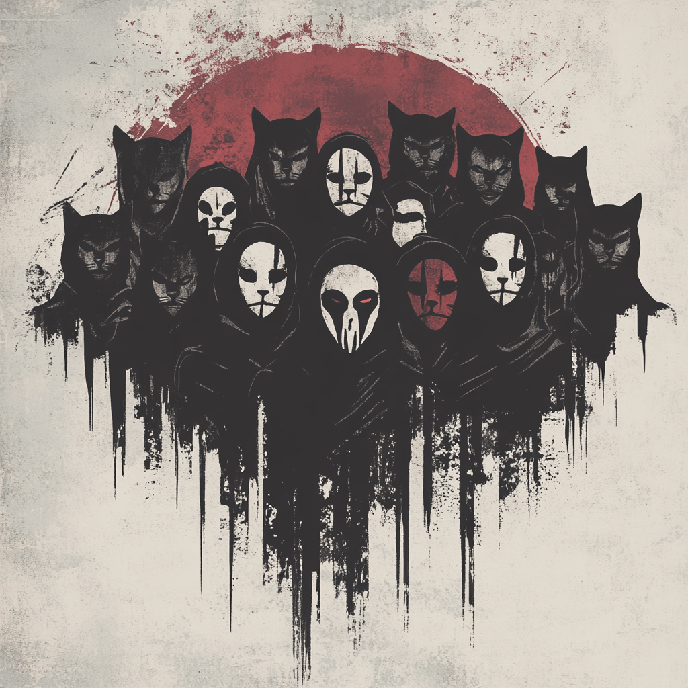

# The Network

> "In connection, we find strength. In community, we find purpose."

## Overview

The paths of liberation are forged through connection. Our network grows through channels both visible and hidden, each node strengthening our collective resistance.

## Community Channels

### Gateway
- Orientation for new members
- Introduction to concepts
- Initial guidance and support

### Nexus
- Community hub
- Open discussion
- Collaboration space

### Archives
- Knowledge repository
- Resource collection
- Documentation center

### Laboratory
- Development workspace
- Project coordination
- Technical implementation

### Observatory
- Strategic analysis
- Pattern recognition
- Future planning

## Digital Commons

### Discord Community
Join our active community: [Nullsect Discord](https://discord.gg/5daPN2nB)

## Network Nodes

### Core Contributors
- **@ViraXVespa** - Purveyor of cognitive catalysts
- **@brunOvop** - Digital frameworks explorer

---

_See also: [Directive](./directive.md), [Manifesto](./manifesto.md), [Nullsect](./nullsect.md)_
