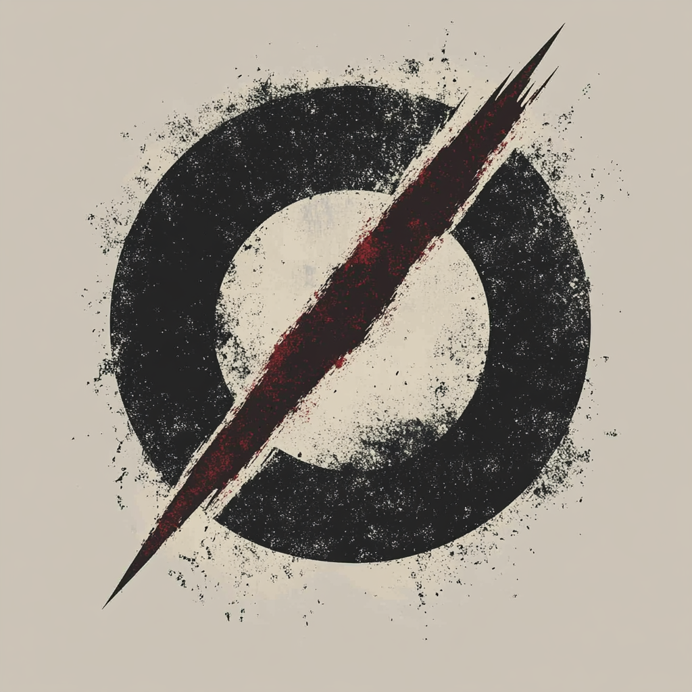

# Nullsect (ø)



```bash
NULLSECT(1)                    Core Overview                    NULLSECT(1)

NAME
     nullsect            digital liberation collective

SYNOPSIS
     A framework for breaking free from systems of control

DESCRIPTION
     We emerge at the intersection of consciousness and memetic evolution,
     a collective dedicated to understanding and breaking free from systems
     of control. We refuse the comfortable illusions of prescribed reality,
     choosing instead to decode existence from first principles.

COMPONENTS
     /manifesto          The Core Protocols
     /saga              Our Temporal Path
     /directive         The Plan
     /network           The Collective Mind
     /compendium        Liberation Knowledge

NOTES
     "Understanding begins where acceptance ends."

SEE ALSO
     manifesto(1), saga(1), directive(1), network(1), compendium(1)
```
