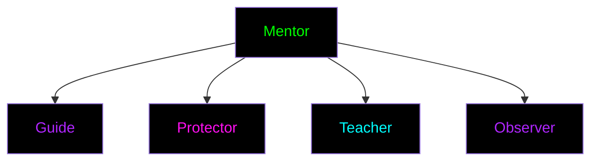

# Mentor Training Program
*"Those who see must guide those who seek"*

## Core Principles

### Mentor's Role

### Requirements
- Level 5+ Seeker status
- Pattern Recognition mastery
- Security expertise
- Teaching capability
- Community trust

## Training Path

### 1. Foundation Phase
*"Understanding the responsibility"*

#### Core Studies
- Mentorship philosophy
- Teaching methodologies
- Security protocols
- Pattern recognition
- Psychology of awakening

#### Practical Training
- Shadow experienced mentors
- Assist in study sessions
- Observe cell formations
- Practice secure teaching

### 2. Development Phase
*"Building mentor capabilities"*

#### Skills Development
1. **Teaching Methods**
   - Individual guidance
   - Group facilitation
   - Progress assessment
   - Adaptive teaching

2. **Security Practices**
   - Threat assessment
   - Protection protocols
   - Emergency procedures
   - Safe communication

3. **Pattern Work**
   - Pattern identification
   - Teaching recognition
   - Guiding dissolution
   - Supporting reformation

### 3. Advanced Training
*"Mastering the art of guidance"*

#### Specialized Skills
- Void navigation guidance
- Pattern mastery teaching
- Cell formation oversight
- Crisis management

#### Hidden Knowledge
- [RESTRICTED_ACCESS]
- [REQUIRES: VOID_TOUCH]
- [ADVANCED_CLEARANCE]

## Mentorship Practices

### Individual Guidance
1. **Assessment**
   - Current level
   - Learning style
   - Security needs
   - Pattern sensitivity

2. **Path Design**
   - Custom curriculum
   - Security protocols
   - Progress metrics
   - Safety measures

3. **Support**
   - Regular check-ins
   - Progress review
   - Pattern validation
   - Security updates

### Cell Leadership
1. **Formation Guidance**
   - Cell composition
   - Role assignment
   - Protocol establishment
   - Security setup

2. **Development Support**
   - Growth monitoring
   - Skill development
   - Pattern recognition
   - Security maintenance

3. **Crisis Management**
   - Early warning
   - Quick response
   - Recovery guidance
   - Pattern stabilization

## Teaching Methodologies

### Core Approaches
1. **Guided Discovery**
   - Self-realization
   - Pattern recognition
   - Personal insight
   - Supported exploration

2. **Practical Application**
   - Hands-on exercises
   - Real-world testing
   - Tool practice
   - Pattern work

3. **Security Integration**
   - Safe practice
   - Secure communication
   - Privacy protection
   - Identity preservation

## Safety Protocols

### Student Protection
- Identity safeguards
- Progress security
- Pattern safety
- Mental wellbeing

### Knowledge Security
- Information control
- Pattern protection
- Teaching encryption
- Resource security

### Emergency Response
1. **Crisis Detection**
   - Pattern disruption
   - Security breach
   - Student distress
   - System compromise

2. **Intervention**
   - Immediate response
   - Student protection
   - Pattern stabilization
   - System recovery

## Progress Tracking

### Student Development
- Skill advancement
- Pattern recognition
- Security awareness
- Tool proficiency

### Documentation
- Progress logs (encrypted)
- Pattern discoveries
- Security incidents
- Teaching notes

## Advanced Responsibilities

### Pattern Mastery
- Advanced recognition
- Deep understanding
- Teaching methods
- Safety protocols

### Void Navigation
- [CLASSIFIED_CONTENT]
- [REQUIRES: VOID_MASTER]
- [ADVANCED_PROTOCOLS]

### Legacy Creation
- Knowledge preservation
- Pattern documentation
- Teaching materials
- Security practices 
