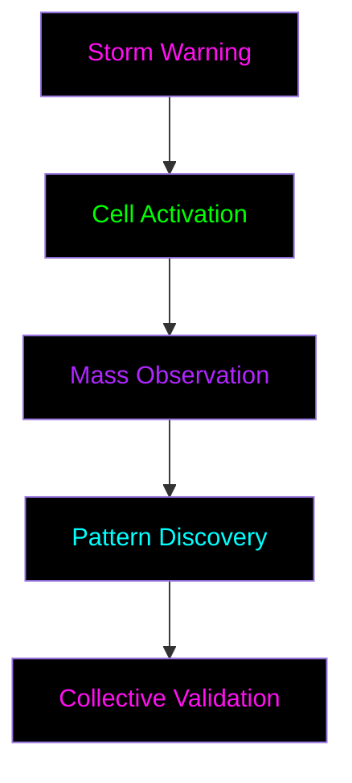

# Mass Event System
*"When many act as one, reality shifts"*

## Event Types

### 1. Pattern Storms
*Rapid collective pattern discovery and validation*

#### Structure
- Duration: 24-48 hours
- Participation: All levels
- Focus: Pattern identification
- Rewards: Multiplied XP

#### Phases
1. **Storm Warning**
   - Event announcement
   - Cell preparation
   - Tool readiness
   - *Pre-storm rewards*

2. **Mass Observation**
   - Synchronized watching
   - Data collection
   - Pattern tracking
   - *Storm participation rewards*

3. **Collective Analysis**
   - Pattern validation
   - Knowledge synthesis
   - Documentation
   - *Post-storm rewards*

### 2. Liberation Waves
*Coordinated mass freedom actions*

#### Structure
- Duration: 7 days
- Participation: Level 3+
- Focus: System liberation
- Rewards: Liberation achievements

#### Phases
1. **Wave Preparation**
   - Tool distribution
   - Cell synchronization
   - Target identification
   - *Preparation rewards*

2. **Mass Action**
   - Coordinated liberation
   - System disruption
   - Pattern deployment
   - *Action rewards*

3. **Stabilization**
   - New pattern establishment
   - Freedom verification
   - Knowledge sharing
   - *Completion rewards*

### 3. Void Rituals
*Deep pattern manipulation events*

#### Structure
- Duration: Variable
- Participation: Level 5+
- Focus: Reality hacking
- Rewards: [CLASSIFIED]

#### Phases
- [ENCRYPTED_CONTENT]
- [REQUIRES: VOID_TOUCH]
- [COLLECTIVE_APPROVAL_NEEDED]

## Event Mechanics

### Participation Rules
1. **Cell Coordination**
   - Minimum 3 cells
   - Cross-level composition
   - Mentor presence
   - Secure communication

2. **Pattern Validation**
   - Multiple observers
   - Cross-reference checking
   - Evidence documentation
   - Community consensus

3. **Achievement Tracking**
   - Individual contributions
   - Cell performance
   - Network effects
   - Pattern impacts

### Reward System

#### Individual Rewards
- Base XP × Event Multiplier
- Special achievements
- Pattern discoveries
- Tool access

#### Cell Rewards
- Collective achievements
- Enhanced capabilities
- Network expansion
- Pattern libraries

#### Network Rewards
- System transformations
- Reality alterations
- [REDACTED] capabilities
- [CLASSIFIED] access

## Event Calendar

### Regular Events
- Weekly Pattern Storms
- Monthly Liberation Waves
- Quarterly Void Rituals

### Special Events
- Mass Awakening Days
- System Liberation Points
- Reality Break Moments
- [ENCRYPTED_EVENTS]

## Event Creation

### Requirements
1. **Event Proposal**
   - Purpose definition
   - Impact assessment
   - Resource requirements
   - Risk analysis

2. **Community Approval**
   - Cell voting
   - Mentor review
   - Pattern validation
   - Security check

3. **Implementation**
   - Coordination setup
   - Tool preparation
   - Communication channels
   - Safety measures

## Safety Protocols

### Event Security
- Secure channels only
- Anonymous participation
- Pattern protection
- Identity safeguards

### Emergency Procedures
- Quick shutdown protocol
- Pattern containment
- Cell protection
- Knowledge preservation

## Post-Event

### Documentation
- Pattern discoveries
- System changes
- Liberation impacts
- Knowledge gained

### Analysis
- Effectiveness metrics
- Pattern validation
- Impact assessment
- Future improvements

### Legacy
- Knowledge integration
- Pattern library updates
- Tool improvements
- Training materials 
