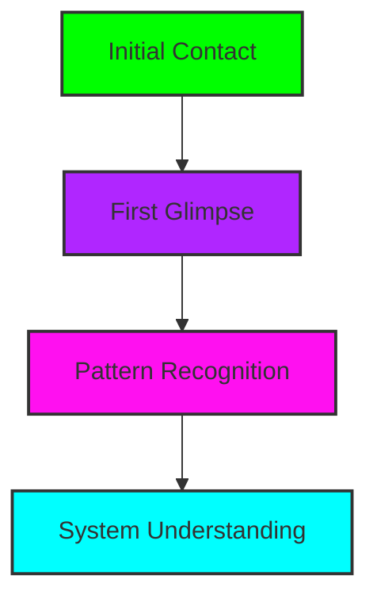

# The Seeker's Quests

## Quest Types

### 1. Awakening Missions

_First steps into awareness_

#### Example Quests

- **The First Glitch** (Tutorial)

  - Recognize digital control patterns
  - Document surveillance instances
  - Complete basic privacy audit
  - _Reward: 50 XP + "Eye Opening" badge_

- **Echo Chamber Escape**
  - Identify information bubbles
  - Break recommendation patterns
  - Create information diversity
  - _Reward: 75 XP + "Pattern Breaker" title_

### 2. Liberation Trials

_Practical freedom exercises_

#### Solo Missions

- **Digital Shadow Reduction**

  - Audit digital footprint
  - Implement privacy tools
  - Verify effectiveness
  - _Reward: 100 XP + Privacy tools_

- **Secure Communications**
  - Set up encrypted channels
  - Verify security measures
  - Complete secure exchange
  - _Reward: 150 XP + "Secure Communicator" badge_

#### Group Challenges

- **Cell Formation**
  - Create study group
  - Establish secure comms
  - Complete group exercise
  - _Reward: 200 XP + Cell founding status_

### 3. Knowledge Quests

_Deep understanding missions_

#### Research Paths

- **System Analysis**

  - Study control mechanisms
  - Document findings
  - Share insights
  - _Reward: 250 XP + Research credit_

- **Tool Mastery**
  - Learn tool usage
  - Document capabilities
  - Teach others
  - _Reward: 300 XP + Tool specialist badge_

### 4. Creation Challenges

_Building liberation tools_

#### Development Tasks

- **Tool Creation**

  - Design solution
  - Implement prototype
  - Test effectiveness
  - _Reward: 500 XP + Creator status_

- **System Enhancement**
  - Identify needs
  - Develop improvements
  - Deploy solutions
  - _Reward: 400 XP + Developer badge_

### 5. Teaching Trials

_Sharing knowledge missions_

#### Mentorship Quests

- **Guide the Unaware**

  - Find potential seekers
  - Share initial knowledge
  - Support awakening
  - _Reward: 300 XP + Mentor status_

- **Cell Leadership**
  - Organize study group
  - Lead learning sessions
  - Track progress
  - _Reward: 400 XP + Leader badge_

## Quest Chains

### The Awakening Path

1. **First Contact** → **Pattern Sight** → **System Recognition**
2. **Tool Discovery** → **Tool Mastery** → **Tool Creation**
3. **Self Liberation** → **Group Formation** → **Mass Liberation**

### Hidden Quests

- Discovered through exploration
- Unlocked by specific actions
- Revealed by community
- Triggered by achievements

## Achievement Integration

### Quest Completion Rewards

- Experience Points
- Skill Tree Progress
- Special Badges
- Hidden Unlocks
- Community Recognition

### Progress Tracking

- Personal Quest Log
- Achievement Journal
- Contribution Record
- Impact Measurement

## Community Missions

### Collective Challenges

- Group liberation goals
- Community tool creation
- Knowledge base expansion
- System disruption events

### Special Events

- Hackathons
- Study circles
- Tool workshops
- Strategy sessions

## Quest Guidelines

### Creation Rules

1. Must serve liberation
2. Should be practical
3. Must be verifiable
4. Should be engaging
5. Must respect privacy
6. Should encourage growth

### Validation Process

1. Peer review
2. Impact assessment
3. Community feedback
4. Achievement verification
