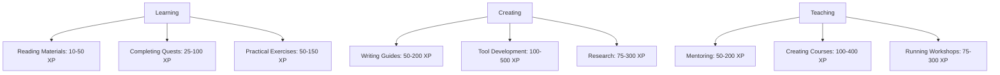
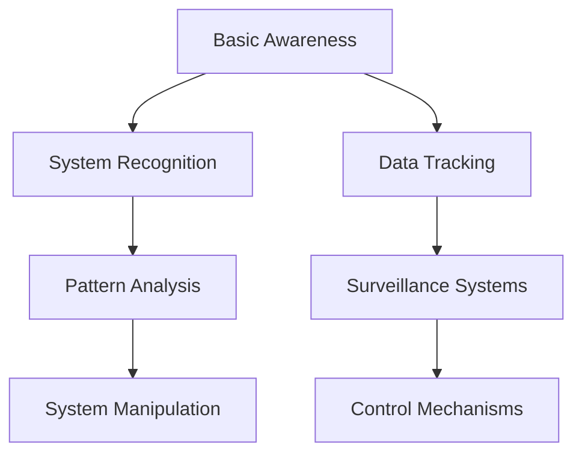
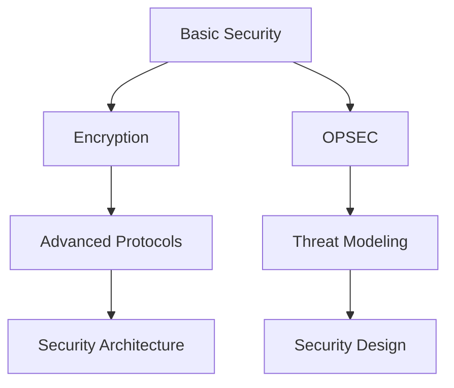
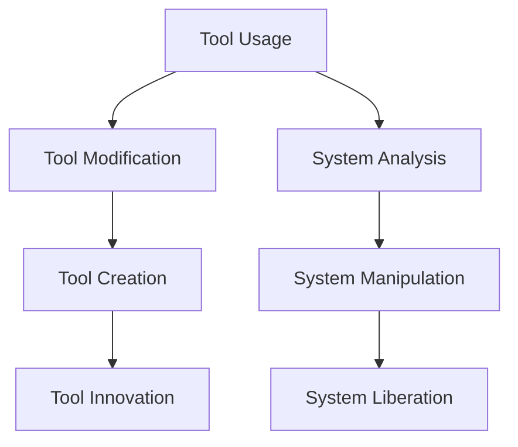

# The Seeker's Path: Skill System

## Experience & Advancement

### XP Sources

### Seeker Levels
1. **Level 1: The Unaware** (0-100 XP)
   - Beginning to see the cage
   - First steps into awareness
   - Basic tool introduction

2. **Level 2: The Awakened** (101-500 XP)
   - Basic system understanding
   - Initial tool proficiency
   - Pattern recognition start

3. **Level 3: The Seeker** (501-1500 XP)
   - Active learning
   - Tool competency
   - Pattern understanding

4. **Level 4: The Adept** (1501-4000 XP)
   - Advanced knowledge
   - Tool mastery
   - Pattern manipulation

5. **Level 5: The Illuminated** (4001-10000 XP)
   - Deep understanding
   - Tool creation
   - Pattern mastery

6. **Level 6: The Guide** (10001-25000 XP)
   - Teaching ability
   - System design
   - Pattern breaking

7. **Level 7: The Architect** (25001+ XP)
   - System mastery
   - Tool innovation
   - Pattern creation

## Skill Trees

### 1. Digital Awareness

### 2. Security Arts

### 3. Liberation Tools

## Achievement System

### Knowledge Domains
- System Understanding
- Privacy Mastery
- Security Expertise
- Tool Proficiency
- Teaching Ability

### Special Achievements
- First Liberation
- Tool Creator
- Pattern Breaker
- Guide of Many
- System Architect

### Hidden Achievements
- The Unexpected
- Beyond the Veil
- Pattern Sight
- Digital Ghost
- System Walker

## Progression Tracking

### Personal Journal
- Skills acquired
- Knowledge gained
- Achievements unlocked
- Patterns recognized

### Community Recognition
- Contributions made
- Lives changed
- Systems affected
- Knowledge shared 
