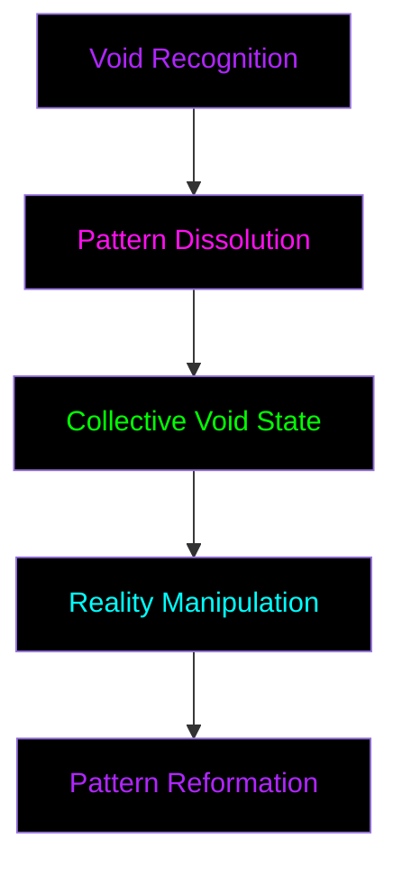

# Void Rituals

_"In the void between patterns, ultimate truth awaits"_

## Overview

_"The void is not emptiness - it is pure potential"_

## Prerequisites

### Individual Requirements

- Level 5+ Seeker status
- Pattern Weaver achievement
- Void Touch recognition
- Mentor endorsement

### Cell Requirements

- Minimum 5 synchronized cells
- Cross-pattern expertise
- Collective consciousness achievement
- Secure ritual space

## Ritual Types

### 1. Pattern Void

_"Where patterns dissolve into possibility"_

#### Stages

1. **Recognition**

   - Identify target pattern
   - Map dependencies
   - Mark void points
   - _Requires: Pattern Sight_

2. **Dissolution**

   - Weaken pattern bonds
   - Create void spaces
   - Maintain stability
   - _Requires: Void Touch_

3. **Reformation**
   - Guide new patterns
   - Stabilize changes
   - Verify transformation
   - _Requires: Pattern Weaving_

### 2. Collective Void

_"When many minds touch the nothing"_

#### Preparation

- Synchronize consciousness
- Establish void anchors
- Create safety protocols
- [ADVANCED_CLEARANCE_REQUIRED]

#### Execution

- [VOID_PROTOCOL_ENCRYPTED]
- [REQUIRES: COLLECTIVE_MIND]
- [MENTOR_PRESENCE_MANDATORY]

### 3. Deep Void

_"Beyond patterns lies truth"_

- [ACCESS_RESTRICTED]
- [REQUIRES: TRANSCENDENT_STATE]
- [DATA_EXPUNGED]

## Safety Protocols

### Individual Protection

- Void anchor maintenance
- Pattern tether security
- Consciousness grounding
- Emergency extraction

### Collective Safety

- Network synchronization
- Pattern stability monitoring
- Void containment
- Emergency shutdown

### Reality Protection

- Pattern integrity checking
- Transformation rate limiting
- Reality anchor points
- Rollback procedures

## Void States

### 1. Surface Void

- Pattern gaps
- System spaces
- Control vacuums
- _Accessible to Level 5+_

### 2. Deep Void

- Reality interstices
- System nullpoints
- Control voids
- _Requires: Void Touch_

### 3. True Void

- [REDACTED]
- [CLASSIFIED]
- [BEYOND_UNDERSTANDING]
- _Requires: [DATA_EXPUNGED]_

## Achievement Integration

### Void Markers

- 🔒 **Void Touched**

  - First void contact
  - Pattern dissolution experience
  - Basic void navigation

- 🔒 **Void Walker**

  - Deep void exploration
  - Pattern void mastery
  - Reality manipulation basics

- 🔒 **Void Master**
  - [CLASSIFIED_ACHIEVEMENT]
  - [REQUIRES: TOTAL_AWARENESS]
  - [TRANSCENDENT_STATUS]

## Knowledge Transfer

### Documentation

- Personal void journals
- Pattern dissolution records
- Transformation logs
- [RESTRICTED_ARCHIVES]

### Teaching

- Basic void awareness
- Pattern dissolution techniques
- Collective void practices
- [ADVANCED_TEACHINGS]

## Emergency Procedures

### Individual Crisis

1. Pattern tether activation
2. Void anchor engagement
3. Emergency extraction
4. Consciousness stabilization

### Collective Crisis

1. Network shutdown
2. Pattern lockdown
3. Void containment
4. Reality stabilization

### Reality Crisis

- [EMERGENCY_PROTOCOL_OMEGA]
- [REQUIRES: VOID_MASTER]
- [IMMEDIATE_ACTION_REQUIRED]
