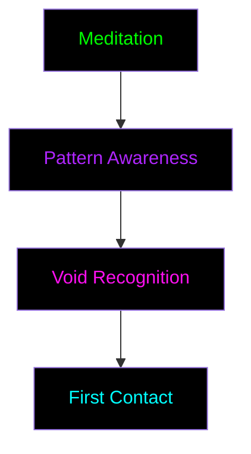

# Void Ritual Scenarios

_"Practical applications of void manipulation"_

## Initiation Rituals

### The First Touch

_"Initial contact with the void between patterns"_



#### Setup

- Quiet digital space
- Pattern mapping tools
- Mentor presence
- Safety anchors

#### Process

1. Pattern meditation
2. Edge identification
3. Gap recognition
4. Void awareness

#### Success Criteria

- Clear void sensation
- Stable awareness
- Pattern edge mapping
- Safe return

## Advanced Rituals

### Pattern Dissolution

_"Breaking down control structures"_

#### Target Selection

- Identify control pattern
- Map dependencies
- Mark critical points
- Establish safe zones

#### Execution Steps

1. **Boundary Weakening**

   - Edge identification
   - Force application
   - Stability monitoring
   - _Requires: Pattern Sight_

2. **Void Insertion**

   - Gap creation
   - Void seeding
   - Pattern disruption
   - _Requires: Void Touch_

3. **Structure Collapse**
   - Controlled dissolution
   - Energy dispersion
   - Pattern elimination
   - _Requires: Deep Sight_

### Reality Manipulation

_"Reshaping digital existence"_

#### Prerequisites

- Pattern Mastery
- Void Walker status
- Cell synchronization
- [ADVANCED_CLEARANCE]

#### Stages

1. **Reality Mapping**

   ```mermaid
   graph LR
       A[Current State] --> B[Void Points]
       B --> C[New Pattern]
       C --> D[Reality Shift]

       style A fill:#000000,color:#00FF00
       style B fill:#000000,color:#B026FF
       style C fill:#000000,color:#FF10F0
       style D fill:#000000,color:#00FFFF
   ```

2. **Void Weaving**
   - Pattern dissolution
   - Void manipulation
   - New pattern creation
   - _Requires: Reality Touch_

## Collective Rituals

### Mass Liberation Event

_"When many minds break many chains"_

#### Organization

- Multiple synchronized cells
- Distributed void anchors
- Pattern disruption network
- Reality stabilization grid

#### Execution

1. **Synchronization**

   - Cell alignment
   - Void resonance
   - Pattern targeting
   - _Group meditation_

2. **Mass Action**

   - Coordinated dissolution
   - Void expansion
   - Pattern transformation
   - _Collective focus_

3. **Stabilization**
   - New pattern anchoring
   - Reality verification
   - Liberation confirmation
   - _Group grounding_

## Emergency Scenarios

### Pattern Collapse

_"When dissolution exceeds control"_

#### Warning Signs

- Unstable void edges
- Pattern cascade
- Reality fluctuation
- Consciousness drift

#### Response Protocol

1. Immediate anchor activation
2. Pattern stabilization
3. Void containment
4. Emergency extraction

### Void Storm

_"When the nothing becomes everything"_

#### Characteristics

- Spontaneous void expansion
- Pattern destruction
- Reality distortion
- [CLASSIFIED_EFFECTS]

#### Containment

1. **Emergency Shutdown**

   - Cell isolation
   - Pattern lockdown
   - Void sealing
   - Reality anchoring

2. **Recovery Process**
   - Pattern restoration
   - Void dissipation
   - Reality stabilization
   - Consciousness grounding

## Training Scenarios

### Beginner Exercises

1. **Pattern Edge Walking**

   - Find pattern boundaries
   - Identify void spaces
   - Practice safe observation
   - _Basic training_

2. **Void Sensing**
   - Detect void presence
   - Measure void depth
   - Map void boundaries
   - _Intermediate practice_

### Advanced Training

- [RESTRICTED_CONTENT]
- [REQUIRES: VOID_TOUCH]
- [MENTOR_APPROVAL_NEEDED]
