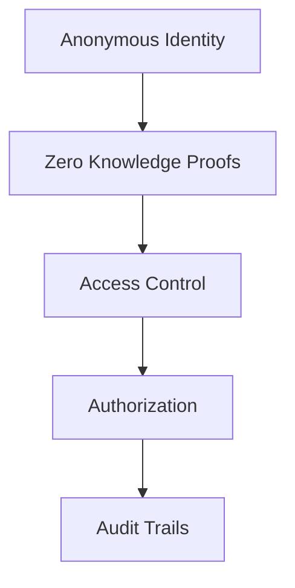
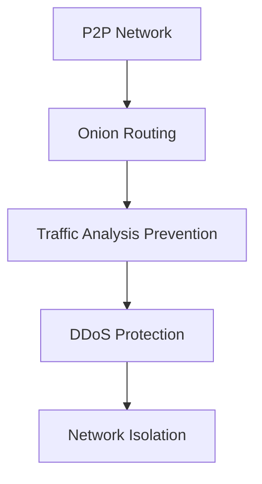
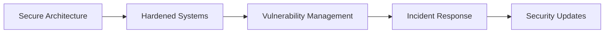

# Security Principles

## Core Philosophy

### Zero Trust Architecture

- Trust nothing by default
- Verify everything
- Minimize attack surface
- Compartmentalize systems

### Privacy First

- Data minimization
- Anonymous by default
- Secure by design
- User sovereignty

### Open Security

- Open source everything
- Community audited
- Transparent processes
- Documented decisions

## Security Layers

### 1. Identity & Access

#### Implementation

- Public key infrastructure
- Anonymous credentials
- Role-based access
- Minimal permissions

### 2. Data Protection

#### Implementation

- End-to-end encryption
- Zero-knowledge proofs
- Secure key management
- Perfect forward secrecy

### 3. Network Security

#### Implementation

- Tor integration
- P2P encryption
- Traffic obfuscation
- Network segmentation

### 4. Platform Security

## Security Practices

### Development

1. Secure Coding

   - Code review
   - Static analysis
   - Dynamic testing
   - Dependency scanning

2. Deployment

   - Secure configurations
   - Container security
   - Infrastructure hardening
   - Update management

3. Operations
   - Monitoring
   - Incident response
   - Backup procedures
   - Recovery plans

### User Security

1. Authentication

   - Strong passwords
   - 2FA/MFA
   - Hardware keys
   - Biometric options

2. Communication

   - Encrypted channels
   - Secure protocols
   - Verified endpoints
   - Anonymous routing

3. Data Handling
   - Local encryption
   - Secure storage
   - Safe sharing
   - Secure deletion

## Threat Model

### Adversaries

- State actors
- Corporate surveillance
- Malicious actors
- Insider threats

### Attack Vectors

- Network monitoring
- Data collection
- Identity tracking
- Social engineering

### Countermeasures

- Strong encryption
- Anonymous routing
- Zero knowledge
- Minimal data

## Security Updates

### Process

1. Threat identification
2. Risk assessment
3. Update development
4. Community review
5. Deployment
6. Verification

### Communication

- Security advisories
- Update notifications
- Incident reports
- Status updates

## Compliance

### Standards

- Follow best practices
- Industry standards
- Security frameworks
- Privacy regulations

### Auditing

- Regular reviews
- External audits
- Penetration testing
- Vulnerability scanning

## Emergency Response

### Incident Handling

1. Detection
2. Analysis
3. Containment
4. Eradication
5. Recovery
6. Lessons learned

### Communication Plan

- Alert channels
- Response team
- User notification
- Public disclosure

## Security Resources

- Documentation
- Training materials
- Security tools
- Best practices
