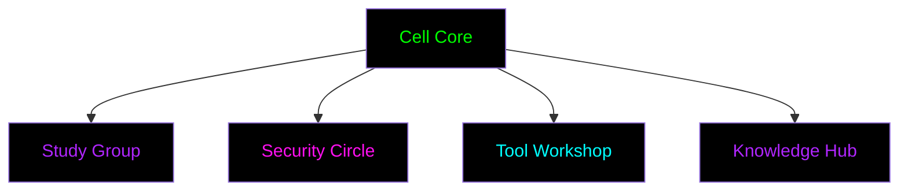
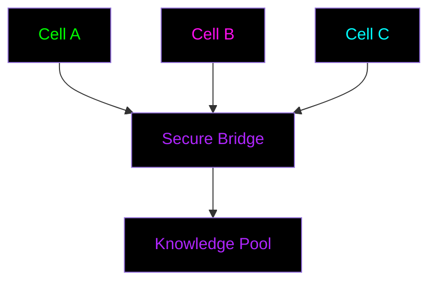

# Cell Operations Guide
*"Small groups, strong bonds, secure growth"*

## Cell Structure

### Core Components

### Cell Composition
- 3-7 core members
- 1-2 mentors
- Mixed skill levels
- Complementary expertise

## Formation Protocol

### 1. Initial Assembly
- Trust verification
- Skill assessment
- Goal alignment
- Security setup

### 2. Infrastructure
- Secure communications
- Knowledge repository
- Tool access
- Meeting spaces

### 3. Operational Structure
- Leadership rotation
- Role assignment
- Schedule setting
- Protocol establishment

## Cell Activities

### Study Sessions
1. **Pattern Recognition**
   - Group observation
   - Pattern documentation
   - Analysis sharing
   - Validation practice

2. **Tool Mastery**
   - Security tools
   - Privacy practices
   - Development skills
   - Documentation methods

3. **Knowledge Building**
   - Literature review
   - Technical analysis
   - Philosophy discussion
   - Strategy development

## Security Protocols

### Communications
- End-to-end encryption
- Signal protocol
- Secure channels
- Emergency contacts

### Operational Security
- Need-to-know basis
- Compartmentalization
- Regular security audits
- Protocol updates

### Data Protection
- Zero-knowledge practices
- Secure storage
- Safe sharing
- Regular purging

## Growth Patterns

### Cell Division
*When a cell reaches critical mass*

1. **Preparation**
   - Identify core groups
   - Train new leaders
   - Establish connections
   - Plan separation

2. **Division Process**
   - Create new spaces
   - Transfer knowledge
   - Establish protocols
   - Maintain links

3. **Post-Division**
   - Support new cells
   - Share resources
   - Monitor health
   - Maintain network

## Inter-Cell Operations

### Network Formation

### Collaboration Types
1. **Knowledge Sharing**
   - Cross-cell learning
   - Resource sharing
   - Tool development
   - Pattern validation

2. **Joint Operations**
   - Mass observations
   - Tool testing
   - Pattern breaking
   - System analysis

3. **Support Networks**
   - Emergency response
   - Resource pooling
   - Skill sharing
   - Mentorship exchange

## Emergency Procedures

### Cell Compromise
1. **Immediate Actions**
   - Communication shutdown
   - Data purge
   - Member notification
   - Network alert

2. **Recovery Process**
   - Damage assessment
   - Protocol review
   - Security upgrade
   - Careful restart

### Network Issues
1. **Detection**
   - Pattern monitoring
   - Security checks
   - Integrity verification
   - Anomaly detection

2. **Response**
   - Network isolation
   - Cell protection
   - Communication rerouting
   - Recovery initiation

## Success Metrics

### Cell Health
- Member engagement
- Knowledge growth
- Tool proficiency
- Security strength

### Network Vitality
- Inter-cell cooperation
- Resource efficiency
- Pattern discovery
- Liberation progress

## Documentation

### Required Records
- Meeting logs (encrypted)
- Progress tracking
- Tool inventory
- Pattern library

### Knowledge Base
- Study materials
- Technical guides
- Security protocols
- Liberation strategies 
