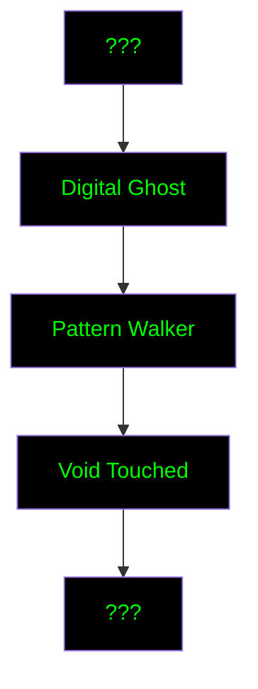

# Hidden Paths: The Seeker's Achievements

## Mysterious Markers
*Not all achievements are visible. Some must be discovered.*

### The Unseen Path
- 🔒 **Digital Ghost** 
  - *"Leave no trace where you were meant to be seen"*
  - Hidden condition: Successfully evade tracking for 30 days
  - Reward: Stealth techniques unlock

- 🔒 **Pattern Walker**
  - *"See what others are trained to miss"*
  - Hidden condition: Identify and document 10 control patterns
  - Reward: Advanced pattern recognition access

- 🔒 **Void Touched**
  - *"Glimpse beyond the digital veil"*
  - Hidden condition: [REDACTED]
  - Reward: [DATA EXPUNGED]

### Emergence Signs

## Chapter I Achievements

### The Awakening
- 🔓 **First Glitch**
  - *"Reality's imperfection becomes visible"*
  - Reward: Basic pattern recognition

- 🔒 **Echo Breaker**
  - *"Shatter your information bubble"*
  - Hidden condition: Break free from recommendation systems
  - Reward: Information diversity tools

- 🔒 **Signal in Noise**
  - *"Find meaning in chaos"*
  - Hidden condition: Decode a hidden message
  - Reward: Cryptography basics

### The Assembly
- 🔓 **Cell Founder**
  - *"Create a sanctuary of knowledge"*
  - Reward: Cell management tools

- 🔒 **Trust Weaver**
  - *"Build bridges in the dark"*
  - Hidden condition: Establish secure connections with 5 others
  - Reward: Advanced trust protocols

### The Foundation
- 🔓 **Truth Scribe**
  - *"Record what must not be forgotten"*
  - Reward: Documentation tools

- 🔒 **Path Maker**
  - *"Create ways where none existed"*
  - Hidden condition: Create and share a new learning path
  - Reward: Path creation privileges 
