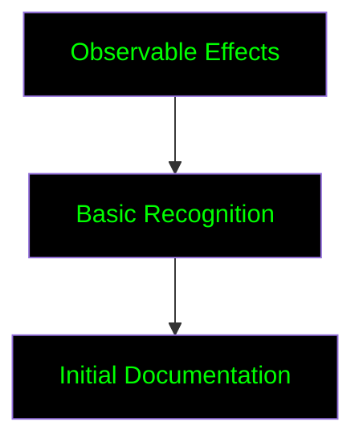
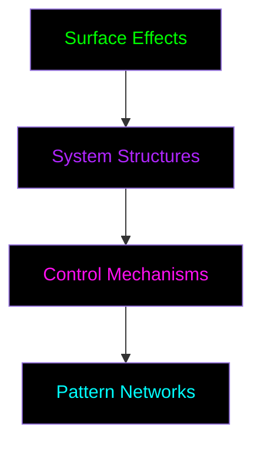

# Pattern Recognition System

## Core Concepts

### What are Patterns?
*"The cage is built of recurring structures - learn to see them"*

1. **Control Patterns**
   - Data collection routines
   - Behavior modification systems
   - Attention manipulation mechanisms
   - Choice architecture structures

2. **Liberation Patterns**
   - Privacy preservation techniques
   - Security implementation methods
   - Independence building practices
   - Knowledge sharing structures

## Pattern Levels

### 1. Surface Patterns (Level 1)


- Targeted advertising
- Content recommendations
- Social media feeds
- Basic tracking

### 2. System Patterns (Level 2)


- Data flow systems
- Behavior modification loops
- Dependency chains
- Control hierarchies

### 3. Deep Patterns (Level 3)
- [PATTERN_ACCESS_RESTRICTED]
- [REQUIRES: ADVANCED_SIGHT]
- [CLEARANCE_NEEDED]

## Pattern Recognition Training

### Basic Training
1. **Observer Protocol**
   - Document daily digital interactions
   - Map data collection points
   - Track behavior modification attempts
   - *Reward: Pattern Sight (Basic)*

2. **Analysis Protocol**
   - Identify pattern components
   - Map pattern relationships
   - Document pattern effects
   - *Reward: Pattern Analysis (Basic)*

3. **Recognition Protocol**
   - Pattern categorization
   - Pattern mapping
   - Pattern documentation
   - *Reward: Pattern Recognition (Basic)*

### Advanced Training
- [ACCESS_LEVEL_REQUIRED]
- [COMPLETE_BASIC_TRAINING]
- [MENTOR_APPROVAL_NEEDED]

## Pattern Documentation

### Pattern Template
```markdown
# Pattern: [NAME]
## Classification
- Type: [Control/Liberation]
- Level: [Surface/System/Deep]
- Category: [Surveillance/Modification/Control]

## Components
- [Component 1]
- [Component 2]
- [Component n]

## Effects
- Primary: [Main impact]
- Secondary: [Side effects]
- Tertiary: [Long-term implications]

## Counter-Patterns
- [Counter-measure 1]
- [Counter-measure 2]
- [Counter-measure n]

## Documentation
- [Evidence]
- [Analysis]
- [References]
```

## Pattern Library
*Access levels required for different sections*

### Level 1 (Public)
- Basic tracking patterns
- Simple control systems
- Common manipulation techniques

### Level 2 (Seekers)
- Advanced surveillance patterns
- Behavior modification systems
- Data correlation networks

### Level 3 (Adepts)
- [RESTRICTED_ACCESS]
- [ADVANCED_CLEARANCE_REQUIRED]
- [MENTOR_APPROVAL_NEEDED]

## Pattern Validation

### Community Verification
1. Pattern submission
2. Peer review
3. Evidence validation
4. Pattern classification
5. Library inclusion

### Validation Requirements
- Multiple independent observations
- Documented evidence
- Reproducible effects
- Clear counter-measures
- Community consensus

## Achievement Integration

### Pattern Mastery
- Pattern Sight (Level 1)
- Pattern Walker (Level 2)
- Pattern Weaver (Level 3)
- [REDACTED] (Level 4)

### Hidden Achievements
- Pattern Breaker
- System Walker
- Void Touched
- [DATA_EXPUNGED] 
