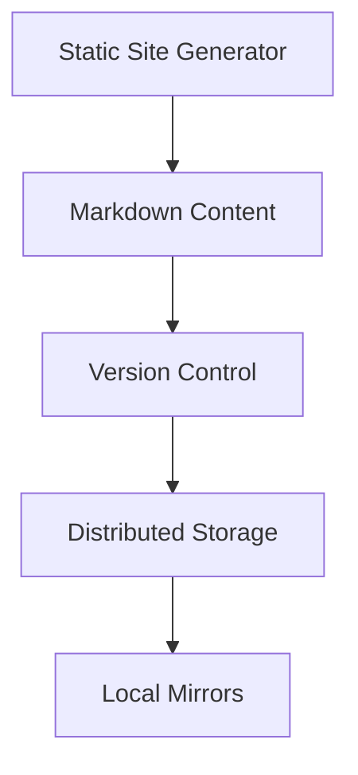
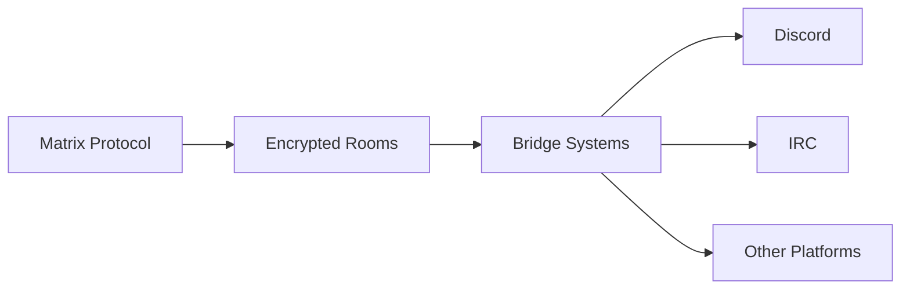
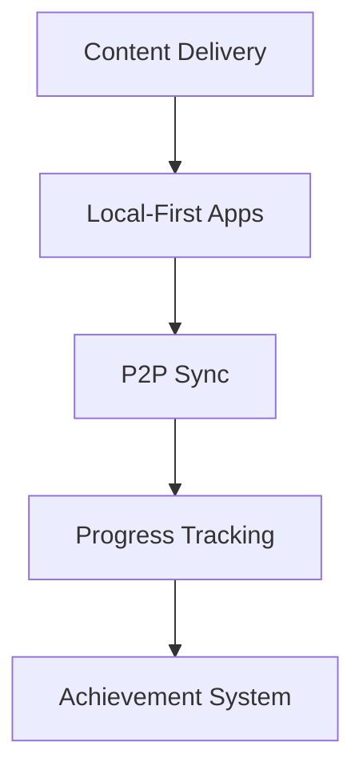

# Technical Architecture

## Core Principles

### 1. Security First

- End-to-end encryption
- Zero-knowledge design
- Local-first data
- No central points of failure

### 2. Privacy by Design

- Minimal data collection
- Anonymous participation
- Secure communication
- Data sovereignty

### 3. Decentralized Architecture

- Distributed systems
- P2P networking
- Federation capabilities
- Local-first approach

## Platform Components

### 1. Knowledge Base

- Static site generation (Hugo/Jekyll)
- Git-based content management
- Distributed storage system
- Local-first content access

### 2. Communication Layer

- Matrix protocol for core communication
- Bridges to other platforms
- End-to-end encryption
- Federation support

### 3. Learning Platform

- Offline-first learning materials
- P2P progress synchronization
- Local achievement tracking
- Distributed validation

### 4. Tool Repository

- Git-based version control
- Decentralized package registry
- Code signing and verification
- P2P distribution network

## Security Architecture

### Authentication

- Public key infrastructure
- Anonymous credentials
- Zero-knowledge proofs
- Decentralized identity

### Data Protection

- Client-side encryption
- Zero-knowledge storage
- Secure key management
- Data minimization

### Network Security

- Onion routing support
- P2P encryption
- Network isolation
- Traffic obfuscation

## Deployment Model

### Infrastructure

- Self-hosted options
- Docker containers
- P2P networks
- Local-first apps

### Distribution

- Git repositories
- P2P networks
- Package managers
- Manual distribution

## Development Stack

### Frontend

- Static site generators
- Progressive Web Apps
- Local-first applications
- Offline capabilities

### Backend

- Serverless where needed
- P2P networking
- Local processing
- Distributed storage

### Tools & Libraries

- Open source only
- Audited dependencies
- Minimal attack surface
- Community-verified
